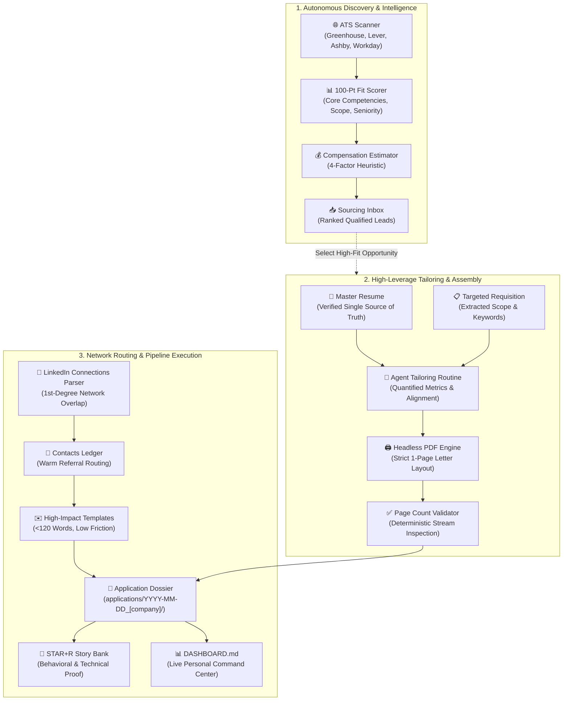

# 🚀 Agentic Career Engine (ACE)

[](LICENSE)
[](#-zero-hallucination-architecture)
[](#-privacy--security-first)
[](#-headless-1-page-pdf-compiler)
[](#-standardized-application-dossiers)

> **The open-source, agent-assisted career command center.**  
> Transform chaotic job hunts into an organized, high-leverage operating system by pairing your search with an autonomous AI coding assistant.

---

## 💡 What is ACE?

Finding a job in today's market is fundamentally a distributed systems problem: sourcing high-match opportunities across fragmented Applicant Tracking Systems (ATS), tailoring resumes to exact requisitions, ensuring documents fit strictly on a single page, tracking applications, finding 1st-degree referrals, and preparing for behavioral loops.

**ACE** pairs you with an autonomous AI coding assistant (such as **Google Antigravity**, **Cursor**, **Windsurf**, or **Claude Code**) to act as your personal career chief of staff. Whether you are leading operations, engineering, healthcare programs, finance, or product teams, ACE turns fragmented job hunts into a structured, high-leverage operating system.

Instead of juggling spreadsheets, manual document formatting, and lost notes, ACE gives you a production-grade workspace where your AI agent autonomously scans ATS boards, tailors applications into isolated dossiers, matches your network, compiles pixel-perfect PDFs, coaches your interview narratives, and maintains your pipeline.

---

## 🔄 The ACE Operating System Pipeline



---

## 🗂️ Workspace Architecture & Directory Map

```text
ACE/
├── .agents/
│   └── skills/
│       └── ats-job-scanner/             # Autonomous skill for scanning & scoring ATS listings
│           ├── SKILL.md                 # Skill definition & execution protocol
│           └── references/
│               └── scoring_rubric.md    # 100-point deterministic fit scoring algorithm
├── applications/
│   ├── dossier_template/                # Canonical blueprint for individual application dossiers
│   │   ├── job_description.md          # Requisition requirements, compensation, & source text
│   │   ├── outreach_and_timeline.md    # Referral log, outreach messages, & milestone funnel
│   │   └── interview_prep.md           # 90s screen pitch, metrics cheat-sheet, & STAR pairings
│   ├── ledger.json                      # Programmatic single source of truth for all applications
│   ├── sourcing_inbox.json              # Structured discovered job leads
│   ├── sourcing_inbox.md                # Ranked visual dashboard of active opportunities
│   └── YYYY-MM-DD_[company]/           # Individual, isolated application dossiers (ignored by git)
├── examples/
│   └── demo_showcase/                   # ISOLATED DEMO DATA (Prevents AI hallucinations)
│       ├── Alex_Morgan_Resume.md        # Sample Senior SWE master resume
│       ├── Alex_Morgan_Resume.pdf       # Compiled sample 1-page PDF
│       ├── sample_job_description.md    # Sample platform engineering JD
│       └── sample_dashboard.md          # Sample command center dashboard
├── network/
│   ├── contacts_ledger.md               # 1st-degree contacts & referral paths
│   └── outreach_templates.md            # Tested, low-friction networking templates
├── resumes/
│   └── resume_template.md               # Clean, 1-page typography-constrained template
├── scripts/
│   ├── check_pdf_pages.ps1              # Validates that compiled PDF is strictly 1 page
│   ├── parse_connections.ps1            # Maps LinkedIn connections to target employers
│   ├── render_resume.ps1                # Headless Edge/Chrome print-to-pdf engine
│   ├── reset_workspace.ps1              # Factory-reset utility for application ledgers
│   └── scan_ats_jobs.ps1                # Automated multi-query ATS search generator
├── stories/
│   └── star_story_bank.md               # Structured Situation-Task-Action-Result narratives
├── workflows/
│   ├── ats_search_config.json           # User configuration (roles, locations, salary floors)
│   └── compensation_estimator.md        # 4-factor compensation estimation heuristic
├── .gitignore                           # Privacy guardrail: blocks private PII/PDF leaks
├── DASHBOARD.md                         # [Generated] Your live, active personal career command center
├── GENESIS_PROMPT.md                    # Core candidate onboarding and initialization prompt
├── QUICK_START.md                       # 3-step setup guide and assistant installation
└── README.md                            # Permanent project documentation & architectural front door
```

---

## ✨ Core Feature Highlights

### 1. 🔍 Autonomous ATS Job Scanner
Bypasses noisy third-party scrapers and job aggregators. Directly targets applicant tracking systems (`boards.greenhouse.io`, `jobs.lever.co`, `jobs.ashbyhq.com`, `myworkdayjobs.com`) filtering out junior/intern positions and ranking opportunities with a transparent **100-Point Fit Rubric**.

### 2. 🖨️ Headless 1-Page PDF Compiler
Never deal with word processors spilling two lines onto an awkward second page. ACE uses a headless Chromium browser (`scripts/render_resume.ps1`) enforcing print margins, modern typography, and proportional line heights. Paired with `scripts/check_pdf_pages.ps1` to deterministically verify that your document never exceeds **exactly 1 page**.

### 3. 📁 Standardized Application Dossiers
Every requisition you pursue is isolated into a dedicated folder (`applications/YYYY-MM-DD_[company]/`). Each dossier encapsulates:
- The verbatim job description and required competencies (`job_description.md`).
- Your tailored single-page markdown and compiled PDF resume.
- Sent outreach messages, referral contacts, and follow-up alarms (`outreach_and_timeline.md`).
- Role-specific interview prep, recruiter screen pitches, and questions to ask (`interview_prep.md`).

### 4. 🧠 Full-Cycle Career Partner (STAR Story Bank & Interview Prep)
ACE goes far beyond resume generation. Through conversational interviewing, your AI assistant helps you extract, quantify, and refine accomplishments in `stories/star_story_bank.md` using the **STAR+R framework**. When preparing for screens, ACE authors 90-second elevator pitches, compiles metric quick-reference cheatsheets, and formulates strategic, high-acumen questions for hiring executives.

### 5. 🤝 LinkedIn Network Intelligence
Export your LinkedIn connections archive and run `scripts/parse_connections.ps1` to surface every 1st-degree connection you have across target organizations. Automatically cross-references incoming job leads against your network so you apply with an internal referral whenever possible.

### 6. 🛡️ Zero-Hallucination Architecture
A common flaw in AI job search tools is the model inventing prior jobs or credentials. ACE enforces a strict architectural boundary:
- All fictional demo examples are sandboxed in `examples/demo_showcase/`.
- Active directories (`resumes/`, `applications/`, `network/`, `stories/`) remain pristine.
- The AI agent tailors resumes **only** using achievements explicitly documented in your verified master resume.

### 7. 💰 4-Factor Compensation Estimator & Offer Negotiation
Many job postings omit compensation. ACE provides a deterministic heuristic framework factoring:
$$\text{Estimated Base} = \text{Role Baseline} \times \text{Company Tier Multiplier} \times \text{Geo Index}$$
allowing you to evaluate real total compensation potential before investing time in an application, and to structure data-backed counter-proposals during offer negotiations.

---

## ⚡ Quickstart Setup

Getting started takes just a few moments:

1. **Open your AI assistant** ([Google Antigravity](https://antigravity.google) or [Cursor](https://cursor.com)) in a new empty folder.
2. Open [`QUICK_START.md`](file:///c:/Code/ACE/QUICK_START.md) and copy the one-line setup prompt into your assistant's chat panel.
3. Your assistant automatically bootstraps the workspace, executes [`GENESIS_PROMPT.md`](file:///c:/Code/ACE/GENESIS_PROMPT.md), interviews you on your career preferences, formats your master resume, and activates your live career command center in **`DASHBOARD.md`** (leaving `README.md` pristine as the permanent project documentation)!

👉 *For detailed instructions, conversational prompts, and FAQs, see [`QUICK_START.md`](file:///c:/Code/ACE/QUICK_START.md).*

---

## 🔒 Privacy & Security First

- **100% Local**: All scripts, resumes, and contacts stay directly on your local computer.
- **No Third-Party APIs Required**: Works with your local AI coding assistant.
- **Built-in Git Safeguards**: The included `.gitignore` automatically prevents your personal resume markdown files, generated PDFs, application dossiers, and LinkedIn `Connections.csv` from ever being pushed to public GitHub repositories.

---

## 🤝 Community & Support

If you found ACE valuable in your career transition:
- Star this repository on GitHub ⭐
- Share it with friends or colleagues currently on the job market!

---

## 📄 License

ACE is released under the **[MIT License](LICENSE)**. Free to use, adapt, and build upon.
