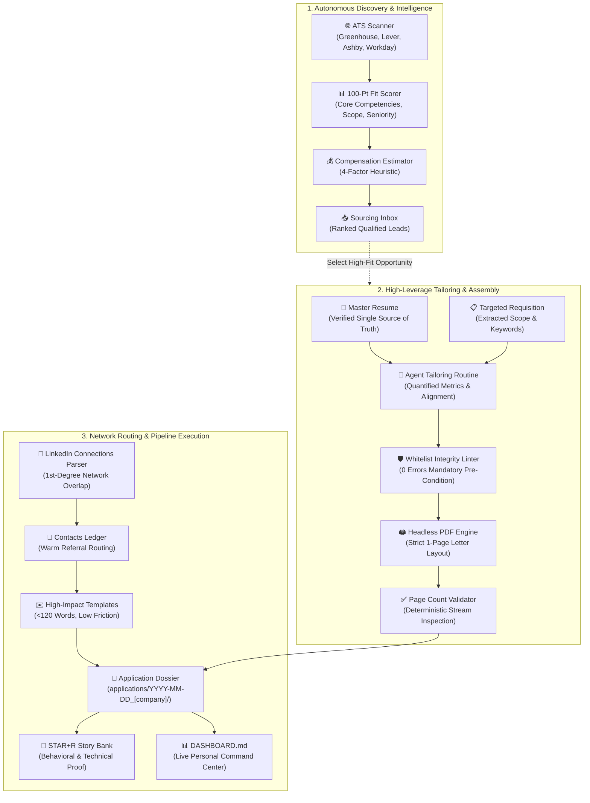

# 🚀 Agentic Career Engine (ACE)

[](LICENSE)
[](#-privacy-storage--security-first)
[](#-pillar-2-precision-engineering--factual-guardrails)
[](#-pillar-2-precision-engineering--factual-guardrails)
[](HARNESS_SETUP.md)
[](#-privacy-storage--security-first)

> **The open-source, agent-assisted career command center.**  
> Transform chaotic job hunts into an organized, high-leverage operating system by pairing your search with an autonomous AI assistant.

---

## 💡 What is ACE?

Finding a job in today's market is fundamentally a distributed systems problem: sourcing high-match opportunities across fragmented Applicant Tracking Systems (ATS), tailoring resumes to exact requisitions, ensuring documents fit strictly on a single page, tracking application pipelines, finding 1st-degree referral paths, and preparing for behavioral interview loops.

**ACE** pairs you with an autonomous AI coding assistant (such as **Google Antigravity**, **Cursor**, **Windsurf**, or **Claude Code**) to act as your personal career chief of staff. Whether you lead engineering, operations, healthcare programs, finance, or product teams, ACE turns fragmented job hunts into a structured, high-leverage operating system.

Instead of juggling spreadsheets, wrestling with document layout margins, and losing context across tabs, ACE gives you a production-grade workspace where your AI agent autonomously scans ATS boards, tailors applications into isolated dossiers, maps your network, compiles pixel-perfect single-page PDFs, coaches your interview narratives, and maintains your pipeline.

---

## ⚡ Quickstart Setup (Get Running in 3 Minutes)

You can initialize your personalized career command center in three simple steps:

### 1. Launch an AI Assistant
If you don't already have an AI desktop assistant installed, download and install one of the following:
- **[Google Antigravity](https://antigravity.google/product/antigravity-2)** (Free desktop application with agentic workflows)
- **[Cursor](https://cursor.com)** (Popular AI-powered desktop editor)

Launch the app, select **File $\rightarrow$ Open Folder**, and open any empty folder (e.g. `Career` or `JobHunt` on your desktop, OneDrive, or Google Drive).

### 2. Run the Genesis Setup Prompt
Copy the prompt below, paste it into your assistant's chat panel, and press **Enter**:

```markdown
Clone https://github.com/clangdanggames/agentic-career-engine.git into this directory (or download and extract the repository zip from https://github.com/clangdanggames/agentic-career-engine/archive/refs/heads/main.zip if Git is not installed), then read and execute the instructions in GENESIS_PROMPT.md.
```

### 3. Activate Your Command Center
Your assistant bootstraps the workspace, guides you through a brief intake interview, formats your master resume, compiles a verified 1-page PDF, and launches your personal **`DASHBOARD.md`** command center!

👉 *For detailed instructions, conversational prompts, and FAQs, see [QUICK_START.md](QUICK_START.md).*

---

## 🔄 The ACE Operating System Pipeline



---

## 🗂️ Workspace Architecture

ACE organizes your career assets into clean, dedicated workspaces designed to eliminate clutter and protect your private data:

| Workspace Section | Purpose | Key Artifacts |
| :--- | :--- | :--- |
| [**`resumes/`**](resumes/) | Factual ground truth & typography templates | Master Resume, Modular Reserve Bullet Bank, 1-Page Layout Template |
| [**`applications/`**](applications/) | Active pipeline & isolated application dossiers | Sourcing Inbox, Pipeline Ledger, Requisition Dossiers (`YYYY-MM-DD_[company]_[reqid]/`) |
| [**`network/`**](network/) | Warm referral mapping & low-friction outreach | Contacts Ledger, LinkedIn Connection Parser, Outreach Templates |
| [**`stories/`**](stories/) | Interview proof & narrative positioning | STAR+R Story Bank, Phone Screen Cheatsheet, Career Gap Framing |
| [**`companies/`**](companies/) | Strategic market map & target prioritization | 3-Tier Company List (Premier, Domain Champions, Regional Anchors) |
| [**`workflows/`**](workflows/) | Search criteria & execution SOPs | ATS Search Config, 20-Min Tailoring SOP, Compensation Estimator |
| [**`scripts/`**](scripts/) | Native automation engine | Headless PDF Compiler, Whitelist Linter, Parity Sync, ATS Scanner, 1-Click Backups |

<details>
<summary><b>Explore Full Directory Layout (Click to expand)</b></summary>

```text
ACE/
├── .agents/skills/ats-job-scanner/ # Autonomous skill for scanning & scoring ATS listings
├── applications/
│   ├── dossier_template/          # Canonical blueprint for individual application dossiers
│   ├── ledger.json                # Programmatic single source of truth for all applications
│   ├── sourcing_inbox.json        # Structured discovered job leads
│   ├── sourcing_inbox.md          # Ranked visual dashboard of active opportunities
│   └── YYYY-MM-DD_[company]_[req]/# Individual isolated dossiers (ignored by git)
├── companies/target_tier_list.md  # 3-tier market map (Premier, Champions, Regional)
├── examples/demo_showcase/        # Isolated sample data & reference artifacts
├── network/                       # Contacts ledger & outreach templates
├── resumes/                       # Master resumes & modular reserve bullet bank
├── scripts/                       # Automation scripts (PDF rendering, linting, syncing, backups)
├── stories/                       # STAR+R stories, screen cheatsheets, & gap framing
├── workflows/                     # Search configs, 20-min SOP, & compensation models
├── AGENTS.md                      # Operational doctrines (Rules 1–8)
├── DASHBOARD.md                   # [Generated] Your live personal career command center
├── GENESIS_PROMPT.md              # Candidate onboarding protocol
├── HARNESS_SETUP.md               # Agent harness permissions & security guide
├── QUICK_START.md                 # 3-step setup guide & assistant instructions
└── README.md                      # Permanent project documentation
```

</details>

---

## ✨ Core Feature Highlights

### 🎯 Pillar 1: Targeted Discovery & Market Intelligence
- **Autonomous ATS Job Scanner & Direct X-Ray Queries**: Directly targets applicant tracking systems (`boards.greenhouse.io`, `jobs.lever.co`, `jobs.ashbyhq.com`, `myworkdayjobs.com`), scoring leads with a transparent **100-Point Fit Rubric** and **Pragmatic 3-Tier Gap Analysis**. Includes ready-to-run 1-click Boolean X-Ray searches in [`workflows/targeted_job_sourcing_queries.md`](workflows/targeted_job_sourcing_queries.md).
- **Bot-Shield Resilience & Direct Requisition Invariant**: Built-in resilience against Cloudflare/WAF bot challenges ensures valid opportunities are never discarded, while guaranteeing all sourced leads point directly to the individual requisition.
- **4-Factor Compensation Estimator & Offer Negotiation**: Evaluates total compensation potential before applying using a deterministic heuristic model factoring role baseline, company tier multiplier, and geographic index ([`workflows/compensation_estimator.md`](workflows/compensation_estimator.md)), equipping you for data-backed negotiation.
- **LinkedIn Network Overlap Intelligence**: Parses your LinkedIn connection export with `scripts/parse_connections.ps1` to surface warm 1st-degree contacts at target employers in [`companies/target_tier_list.md`](companies/target_tier_list.md).

### 🛡️ Pillar 2: Precision Engineering & Factual Guardrails
- **Headless 1-Page PDF Compiler**: Compiles pixel-perfect resumes using headless Edge/Chrome with strict print geometry, proportional typography, and stream page-count validation ([`scripts/check_pdf_pages.ps1`](scripts/check_pdf_pages.ps1)) to ensure documents never spill onto a second page.
- **Closed-Set Whitelist Linter (Zero Hallucination)**: Deterministically enforces **Rule 3** via [`scripts/lint_resume_integrity.ps1`](scripts/lint_resume_integrity.ps1). Prevents LLMs from back-filling unverified tools, certifications, or keywords from job descriptions.
- **Standardized Application Dossiers & Pre-Filled Guides**: Isolates each application into `applications/YYYY-MM-DD_[company]_[reqid]/` containing the exact JD, tailored resume, cover letter, interview prep, and an **Application Form Guide** (`application_form_guide.md`) pre-calculating answers for portal submission fields.
- **Modular Reserve Bank & Multi-Track Variants**: Maintains overflow achievements in [`resumes/modular_reserve_bank.md`](resumes/modular_reserve_bank.md) to swap specialized bullets without bloating 1-page layouts, with multi-track master variants in [`resumes/variants/`](resumes/variants/).

### ⚡ Pillar 3: High-Leverage Career Operations
- **The 20-Minute Micro-Stepped Application SOP**: Micro-steps each application into timed stages in [`workflows/job_hunt_workflow.md`](workflows/job_hunt_workflow.md) to eliminate ADHD overwhelm, perfectionism loops, and application procrastination.
- **Full-Cycle Interview Partner**: Interviews you to extract high-impact **STAR+R stories** ([`stories/star_story_bank.md`](stories/star_story_bank.md)), prepares 90-second elevator pitches and recruiter cheatsheets ([`stories/recruiter_screen_cheatsheet.md`](stories/recruiter_screen_cheatsheet.md)), and structures confident narrative framing for career gaps or sabbaticals ([`stories/career_gap_framing.md`](stories/career_gap_framing.md)).
- **Conflict-Free Engine Lifecycle**: Upstream updates and fresh migrations ([`workflows/engine_lifecycle.md`](workflows/engine_lifecycle.md)) cleanly separate engine code (`scripts/`, `workflows/`, `.agents/`) from personal user state (`resumes/`, `applications/`, `stories/`, `DASHBOARD.md`), guaranteeing zero merge conflicts and zero data loss.

---

## 🔒 Privacy, Storage & Security First

- **Lightweight Architecture**: No Python, Node.js, or Git installation required. ACE runs completely out of the box using built-in PowerShell and Microsoft Edge or Google Chrome.
- **Flexible Storage & Automatic Backups**: Works seamlessly inside **Microsoft OneDrive**, **Google Drive**, **Dropbox**, **iCloud**, private Git repositories, or offline local folders.
- **1-Click Local Snapshots**: Includes [`scripts/backup_workspace.ps1`](scripts/backup_workspace.ps1) to create timestamped `.zip` archives of your career state in `.backups/` on demand.
- **100% Local & Private**: All scripts, resumes, and contacts stay directly on your local computer or private cloud drive.
- **Private Vault Push Lock (Rule 7)**: Built-in `.gitignore` rules prevent personal resumes, PDFs, dossiers, and contact exports from being tracked publicly, and push operations are locked strictly to your private repository.

---

## 🤝 Community & Support

If you found ACE valuable in your career transition:
- Star this repository on GitHub ⭐
- Share it with friends or colleagues currently navigating the job market!

---

## 📄 License

ACE is released under the **[MIT License](LICENSE)**. Free to use, adapt, and build upon.
