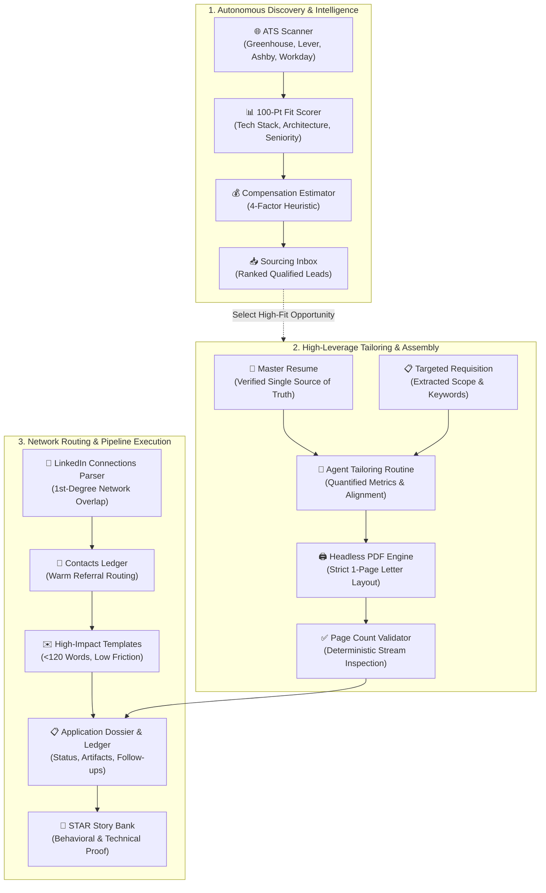

# 🚀 Agentic Career Engine (ACE)

[](LICENSE)
[](#-zero-hallucination-architecture)
[](#-privacy--security-first)
[](#-headless-1-page-pdf-compiler)

> **The open-source, agent-assisted career command center.**  
> Transform chaotic job hunts into an organized, high-leverage operating system by pairing your search with an autonomous AI coding assistant.

---

## 💡 What is ACE?

Finding a job in today's market is fundamentally a distributed systems problem: sourcing high-match opportunities across fragmented Applicant Tracking Systems (ATS), tailoring resumes to exact requisitions, ensuring documents fit strictly on a single page, tracking applications, finding 1st-degree referrals, and preparing for behavioral loops.

**ACE** pairs you with an autonomous AI coding assistant (such as **Google Antigravity**, **Cursor**, **Windsurf**, or **Claude Code**) to act as your personal career chief of staff. 

It is designed for professionals across **any industry or domain**—including **Technology**, **Healthcare & Life Sciences**, **Finance & Accounting**, **Operations & Strategy**, **Product Management**, **Marketing**, **Sales**, and **Executive Leadership**.

Instead of juggling spreadsheets, manual word processor formatting, and lost notes, ACE gives you a production-grade workspace where your AI agent autonomously scans ATS boards, tailors applications, matches your network, compiles pixel-perfect PDFs, and maintains your pipeline.

---

## 🔄 The ACE Operating System Pipeline



---

## 🗂️ Workspace Architecture & Directory Map

```text
ACE/
├── .agents/
│   └── skills/
│       └── ats-job-scanner/             # Autonomous skill for scanning & scoring ATS listings
│           ├── SKILL.md                 # Skill definition & execution protocol
│           └── references/
│               └── scoring_rubric.md    # 100-point deterministic fit scoring algorithm
├── applications/
│   ├── ledger.json                      # Single source of truth for all submitted applications
│   ├── sourcing_inbox.json              # Structured discovered job leads
│   └── sourcing_inbox.md                # Ranked visual dashboard of active opportunities
├── examples/
│   └── demo_showcase/                   # ISOLATED DEMO DATA (Prevents AI hallucinations)
│       ├── Alex_Morgan_Resume.md        # Sample Senior SWE master resume
│       ├── Alex_Morgan_Resume.pdf       # Compiled sample 1-page PDF
│       ├── sample_job_description.md    # Sample platform engineering JD
│       └── sample_dashboard.md          # Sample command center dashboard
├── network/
│   ├── contacts_ledger.md               # 1st-degree contacts & referral paths
│   └── outreach_templates.md            # Tested, low-friction networking templates
├── resumes/
│   └── resume_template.md               # Clean, 1-page typography-constrained template
├── scripts/
│   ├── check_pdf_pages.ps1              # Validates that compiled PDF is strictly 1 page
│   ├── parse_connections.ps1            # Maps LinkedIn connections to target employers
│   ├── render_resume.ps1                # Headless Edge/Chrome print-to-pdf engine
│   ├── reset_workspace.ps1              # Factory-reset utility for application ledgers
│   └── scan_ats_jobs.ps1                # Automated multi-query ATS search generator
├── stories/
│   └── star_story_bank.md               # Structured Situation-Task-Action-Result narratives
├── workflows/
│   ├── ats_search_config.json           # User configuration (roles, locations, salary floors)
│   └── compensation_estimator.md        # 4-factor compensation estimation heuristic
├── .gitignore                           # Privacy guardrail: blocks private PII/PDF leaks
├── GENESIS_PROMPT.md                    # 1-click master prompt to initialize your workspace
├── QUICKSTART.md                        # 3-step setup guide for non-technical users
├── README.md                            # Project command center front door
└── SOCIAL_SHARE_KIT.md                  # Launch copy for LinkedIn, Facebook, and DMs
```

---

## ✨ Core Feature Highlights

### 1. 🔍 Autonomous ATS Job Scanner
Bypasses noisy third-party scrapers and job aggregators. Directly targets applicant tracking systems (`boards.greenhouse.io`, `jobs.lever.co`, `jobs.ashbyhq.com`, `myworkdayjobs.com`) filtering out junior/intern positions and ranking opportunities with a transparent **100-Point Fit Rubric**.

### 2. 🖨️ Headless 1-Page PDF Compiler
Never deal with word processors spilling two lines onto an awkward second page. ACE uses a headless Chromium browser (`scripts/render_resume.ps1`) enforcing print margins, modern typography, and proportional line heights. Paired with `scripts/check_pdf_pages.ps1` to deterministically verify that your document never exceeds **exactly 1 page**.

### 3. 🤝 LinkedIn Network Intelligence
Export your LinkedIn connections archive and run `scripts/parse_connections.ps1` to surface every 1st-degree connection you have across target tech companies. Automatically cross-references incoming job leads against your network so you apply with an internal referral whenever possible.

### 4. 🛡️ Zero-Hallucination Architecture
A common flaw in AI job search tools is the model inventing prior jobs or credentials. ACE enforces a strict architectural boundary:
- All fictional demo examples are sandboxed in `examples/demo_showcase/`.
- Active directories (`resumes/`, `applications/`, `network/`, `stories/`) remain pristine.
- The AI agent tailors resumes **only** using achievements explicitly documented in your `resumes/[User_Name]_Resume_Master.md`.

### 5. 💰 4-Factor Compensation Estimator
Many job postings omit compensation. ACE provides a deterministic heuristic framework factoring:
$$\text{Estimated Base} = \text{Role Baseline} \times \text{Company Tier Multiplier} \times \text{Geo Index}$$
allowing you to evaluate real total compensation potential before investing time in an application.

---

## ⚡ 3-Minute Quickstart (Zero-Jargon Setup)

Getting started requires no command-line or coding knowledge:

1. **Create an empty folder** on your computer (e.g. `Career` or `My_Job_Hunt`) and open it in your AI assistant (**Google Antigravity**, **Cursor**, **Windsurf**, or **Claude Code**).
2. Open [`GENESIS_PROMPT.md`](file:///c:/Code/ACE/GENESIS_PROMPT.md), copy the **One-Shot Bootstrap Prompt**, and paste it directly into your AI assistant chat panel.
3. Your AI agent automatically clones/downloads the codebase, verifies dependencies, interviews you on your career goals, ingests your resume into an exact 1-page PDF, and activates your live dashboard!

👉 *For detailed instructions and FAQs, see [`QUICKSTART.md`](file:///c:/Code/ACE/QUICKSTART.md).*

---

## 🔒 Privacy & Security First

- **100% Local**: All scripts, resumes, and contacts stay directly on your local computer.
- **No Third-Party APIs Required**: Works with your local AI coding assistant.
- **Built-in Git Safeguards**: The included `.gitignore` automatically prevents your personal resume markdown files, generated PDFs, and LinkedIn `Connections.csv` from ever being pushed to public GitHub repositories.

---

## 🤝 Community & Sharing

If you found ACE valuable in your career transition:
- Star this repository on GitHub ⭐
- Use [`SOCIAL_SHARE_KIT.md`](file:///c:/Code/ACE/SOCIAL_SHARE_KIT.md) for plug-and-play launch copy to share with friends, colleagues, or your LinkedIn network!

---

## 📄 License

ACE is released under the **[MIT License](LICENSE)**. Free to use, adapt, and build upon.
