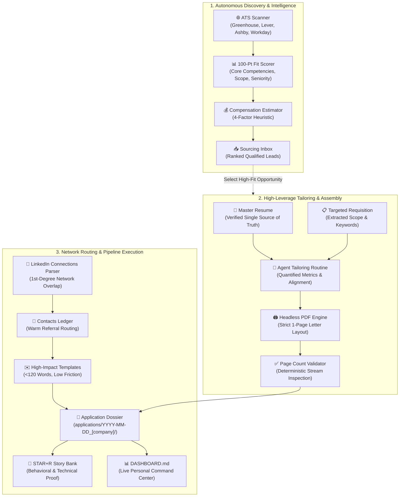

# 🚀 Agentic Career Engine (ACE)

[](LICENSE)
[](#-zero-hallucination-architecture)
[](#-privacy--security-first)
[](#-headless-1-page-pdf-compiler)
[](#-standardized-application-dossiers)

> **The open-source, agent-assisted career command center.**  
> Transform chaotic job hunts into an organized, high-leverage operating system by pairing your search with an autonomous AI coding assistant.

---

## 💡 What is ACE?

Finding a job in today's market is fundamentally a distributed systems problem: sourcing high-match opportunities across fragmented Applicant Tracking Systems (ATS), tailoring resumes to exact requisitions, ensuring documents fit strictly on a single page, tracking applications, finding 1st-degree referrals, and preparing for behavioral loops.

**ACE** pairs you with an autonomous AI coding assistant (such as **Google Antigravity**, **Cursor**, **Windsurf**, or **Claude Code**) to act as your personal career chief of staff. Whether you are leading operations, engineering, healthcare programs, finance, or product teams, ACE turns fragmented job hunts into a structured, high-leverage operating system.

Instead of juggling spreadsheets, manual document formatting, and lost notes, ACE gives you a production-grade workspace where your AI agent autonomously scans ATS boards, tailors applications into isolated dossiers, matches your network, compiles pixel-perfect PDFs, coaches your interview narratives, and maintains your pipeline.

---

## ⚡ Quickstart Setup (Get Running in 3 Minutes)

You can initialize your personalized career command center in three simple steps:

1. **Open Your AI Assistant**: Open [Google Antigravity](https://antigravity.google) (Desktop GUI) or [Cursor](https://cursor.com) in an empty folder (e.g. `Career` or `JobHunt`).
2. **Run the Genesis Setup Prompt**: Copy the prompt below, paste it into your assistant's chat panel, and press **Enter**:

```markdown
Clone https://github.com/clangdanggames/agentic-career-engine.git into this directory (or download and extract the repository zip from https://github.com/clangdanggames/agentic-career-engine/archive/refs/heads/main.zip if Git is not installed), then read and execute the instructions in GENESIS_PROMPT.md.
```

3. **Activate Your Command Center**: Your assistant bootstraps the workspace, interviews you on your career preferences, formats your master resume, compiles a verified 1-page PDF, and generates your personal **`DASHBOARD.md`** command center!

👉 *For detailed instructions, conversational prompts, and FAQs, see [QUICK_START.md](QUICK_START.md).*

---

## 🔄 The ACE Operating System Pipeline



---

## 🗂️ Workspace Architecture & Directory Map

```text
ACE/
├── .agents/
│   └── skills/
│       └── ats-job-scanner/             # Autonomous skill for scanning & scoring ATS listings
│           ├── SKILL.md                 # Skill definition & execution protocol
│           └── references/
│               └── scoring_rubric.md    # 100-point fit scoring with 3-tier gap analysis
├── applications/
│   ├── dossier_template/                # Canonical blueprint for individual application dossiers
│   │   ├── job_description.md          # Requisition requirements, compensation, & source text
│   │   ├── application_form_guide.md   # Pre-filled cheat sheet for ATS portal submission fields
│   │   ├── cover_letter.md             # Tailored 1-page cover letter template
│   │   ├── outreach_and_timeline.md    # Referral log, outreach messages, & milestone funnel
│   │   └── interview_prep.md           # 90s screen pitch, metrics cheat-sheet, STAR pairings, & questions
│   ├── ledger.json                      # Programmatic single source of truth for all applications
│   ├── sourcing_inbox.json              # Structured discovered job leads
│   ├── sourcing_inbox.md                # Ranked visual dashboard of active opportunities
│   └── YYYY-MM-DD_[company]_[reqid]/    # Individual, isolated application dossiers (ignored by git)
├── companies/
│   └── target_tier_list.md              # 3-tier strategic market map (Premier, Domain Champions, Local)
├── examples/
│   └── demo_showcase/                   # ISOLATED DEMO DATA (Prevents AI hallucinations)
│       ├── Alex_Morgan_Resume.md        # Sample Senior SWE master resume
│       ├── Alex_Morgan_Resume.pdf       # Compiled sample 1-page PDF
│       ├── sample_job_description.md    # Sample platform engineering JD
│       └── sample_dashboard.md          # Sample command center dashboard
├── network/
│   ├── contacts_ledger.md               # 1st-degree contacts & referral paths
│   └── outreach_templates.md            # Tested, low-friction networking templates
├── resumes/
│   ├── modular_reserve_bank.md          # Overflow bank of verified specialized bullets
│   ├── resume_template.md               # Clean, 1-page typography-constrained template
│   └── variants/                        # Multi-track baseline master resumes (TPM, SRE, Ops)
├── scripts/
│   ├── backup_workspace.ps1             # Native 1-click snapshot utility (pure PowerShell, zero external dependencies)
│   ├── check_pdf_pages.ps1              # Validates that compiled PDF is strictly 1 page
│   ├── lint_resume_integrity.ps1        # Deterministic linter enforcing Rule 3 whitelist integrity & tag isolation
│   ├── migrate_workspace.ps1            # Imports career history/dossiers from legacy or older ACE workspaces
│   ├── parse_connections.ps1            # Maps LinkedIn connections to target employers
│   ├── render_resume.ps1                # Headless Edge/Chrome print-to-pdf engine (-VerifyIntegrity)
│   ├── reset_workspace.ps1              # Factory-reset utility for application ledgers
│   ├── scan_ats_jobs.ps1                # Automated multi-query ATS search generator & link auditor (-VerifyInbox)
│   ├── sync_pipeline.ps1                # Rule 5 validator maintaining 100% parity between ledger and dashboard
│   └── update_engine.ps1                # Safe, in-place engine updater (preserves all personal user data)
├── stories/
│   ├── career_gap_framing.md            # Framing sabbaticals, layoffs, or pauses with confidence
│   ├── recruiter_screen_cheatsheet.md   # Phone screen pitches, salary scripts, & reverse questions
│   └── star_story_bank.md               # Structured Situation-Task-Action-Result-Reflection narratives
├── workflows/
│   ├── ats_search_config.json           # User configuration (roles, locations, salary floors)
│   ├── compensation_estimator.md        # 4-factor compensation estimation heuristic
│   ├── engine_lifecycle.md              # Lifecycle guide for in-place updates and workspace migration
│   ├── job_hunt_workflow.md             # Operational Rules 1–5, 20-min SOP, & energy budgeting
│   ├── project_ingestion_prompt.md      # Cross-repo prompt to extract bullets & stories into ACE
│   ├── storage_and_backup.md            # Deterministic agent SOP for Git, Cloud Drive sync, & local snapshots
│   └── targeted_job_sourcing_queries.md # 1-click Boolean X-Ray searches for ATS boards
├── .gitignore                           # Privacy guardrail: blocks private PII/PDF leaks
├── AGENTS.md                            # Universal cross-IDE operational doctrines (Rules 1–8)
├── DASHBOARD.md                         # [Generated] Your live, active personal career command center
├── GENESIS_PROMPT.md                    # Core candidate onboarding and initialization prompt
├── HARNESS_SETUP.md                     # Recommended agent harness permissions, domains, & security guide
├── QUICK_START.md                       # 3-step setup guide and assistant installation
└── README.md                            # Permanent project documentation & architectural front door
```

---

## ✨ Core Feature Highlights

### 1. 🔍 Autonomous ATS Job Scanner & Direct X-Ray Queries
Bypasses noisy third-party scrapers and job aggregators. Directly targets applicant tracking systems (`boards.greenhouse.io`, `jobs.lever.co`, `jobs.ashbyhq.com`, `myworkdayjobs.com`), scoring leads with a transparent **100-Point Fit Rubric** featuring a **Pragmatic 3-Tier Gap Analysis**. Also includes ready-to-run 1-click Boolean X-Ray Google search strings in [`workflows/targeted_job_sourcing_queries.md`](workflows/targeted_job_sourcing_queries.md).

### 2. 🖨️ Headless 1-Page PDF Compiler & Automated Integrity Linter
Never deal with word processors spilling two lines onto an awkward second page. ACE uses a headless Chromium browser (`scripts/render_resume.ps1`) enforcing print margins, modern typography, and proportional line heights. Paired with `scripts/check_pdf_pages.ps1` to deterministically verify that your document never exceeds **exactly 1 page**, and `scripts/lint_resume_integrity.ps1` to programmatically ensure no unverified skills or hallucinated buzzwords sneak past review.

### 3. 📁 Standardized Application Dossiers & Form Guides
Every requisition you pursue is isolated into a dedicated folder (`applications/YYYY-MM-DD_[company]_[reqid]/`, falling back to `_[role_slug]/` if unlisted, and `_2` on collision). Each dossier encapsulates:
- The verbatim job description and required competencies (`job_description.md`).
- Your tailored single-page markdown and compiled PDF resume (`[Name]_Resume_[Company]_[ReqID].pdf`).
- An **Application Form Guide** (`application_form_guide.md`) pre-calculating exact answers for tricky ATS portal questions (salary numbers, work authorization, screening prompts) to eliminate application friction.
- A tailored 1-page cover letter (`cover_letter.md`) when beneficial.
- Sent outreach messages, referral contacts, and milestone timeline (`outreach_and_timeline.md`).
- Role-specific interview prep, 90-second pitches, whiteboard flows, and reverse questions (`interview_prep.md`).

### 4. 🧠 Full-Cycle Career Partner (STAR+R Stories, Screen Cheatsheets & Gap Framing)
ACE goes far beyond resume generation. Through conversational interviewing, your AI assistant helps you extract, quantify, and refine accomplishments in `stories/star_story_bank.md` using the **STAR+R framework**. ACE equips you with a phone screen cheat sheet (`stories/recruiter_screen_cheatsheet.md`), scripts for explaining career pauses or sabbaticals with confidence (`stories/career_gap_framing.md`), and high-acumen questions for hiring executives.

### 5. 🧩 Modular Reserve Bank & Multi-Track Variants
Because a resume must fit strictly on 1 page, `resumes/modular_reserve_bank.md` maintains a verified repository of specialized achievement bullets ready to swap in for niche postings without bloating your default master resume. For candidates targeting multiple disciplines, `resumes/variants/` maintains calibrated master baselines.

### 6. 🛡️ Operational Doctrine & Zero-Hallucination Guardrails
Documented in [`workflows/job_hunt_workflow.md`](workflows/job_hunt_workflow.md):
- **Rule 1 (Confirmation Gate)**: Agent never marks an application as applied or outreach sent without explicit candidate confirmation.
- **Rule 2 (Immutable Resumes)**: Submitted resumes are frozen as permanent historical artifacts; subsequent revisions use versioning `_v2`.
- **Rule 3 (Closed-Set Whitelist)**: Master Resume and Reserve Bank form an immutable factual ceiling. Zero keyword back-filling.
- **20-Minute Micro-Stepped Application SOP**: Breaks each application into four timed micro-steps to eliminate ADHD overwhelm and perfectionism.

### 7. 🤝 LinkedIn Network Intelligence & Strategic Tier Mapping
Export your LinkedIn connections archive and run `scripts/parse_connections.ps1` to surface every 1st-degree connection you have across target organizations in `companies/target_tier_list.md`. Automatically cross-references incoming job leads against your network so you apply with an internal referral whenever possible.

### 8. 💰 4-Factor Compensation Estimator & Offer Negotiation
Many job postings omit compensation. ACE provides a deterministic heuristic framework factoring:
$$\text{Estimated Base} = \text{Role Baseline} \times \text{Company Tier Multiplier} \times \text{Geo Index}$$
allowing you to evaluate real total compensation potential before investing time in an application, and to structure data-backed counter-proposals during offer negotiations.

### 9. 🔄 Conflict-Free Lifecycle (In-Place Updates & Workspace Migration)
Never fear Git merge conflicts when the engine evolves. ACE strictly isolates **Engine Code** from **Personal User State**:
- **In-Place Updates** ([`scripts/update_engine.ps1`](scripts/update_engine.ps1)): Snapshots your configuration and updates core scripts/prompts from GitHub while leaving resumes, applications, stories, contacts, and `DASHBOARD.md` 100% untouched.
- **Fresh Workspace Migration** ([`scripts/migrate_workspace.ps1`](scripts/migrate_workspace.ps1)): Seamlessly ports all application dossiers, master resumes, story banks, contacts, and ledgers from older workspaces or legacy folders into a clean, newly cloned ACE installation. Detailed in [`workflows/engine_lifecycle.md`](workflows/engine_lifecycle.md).

---

## 🔒 Privacy, Storage & Security First

- **Zero Heavy Prerequisites**: No Python, Node.js, or Git required. ACE runs out of the box using built-in PowerShell and Microsoft Edge or Google Chrome.
- **Flexible Storage & Backups**: Works seamlessly inside **Microsoft OneDrive**, **Google Drive**, **Dropbox**, **iCloud**, private Git repositories, or offline local folders.
- **1-Click Local Snapshots**: Includes `scripts/backup_workspace.ps1` to archive your personal career state to `.backups/` anytime with zero dependencies.
- **100% Local**: All scripts, resumes, and contacts stay directly on your local computer or private cloud drive.
- **Built-in Git Safeguards**: If Git is used, `.gitignore` automatically prevents personal resumes, generated PDFs, dossiers, and LinkedIn data from ever being pushed publicly. Rule 7 strictly locks push operations to your private repository.

---

## 🤝 Community & Support

If you found ACE valuable in your career transition:
- Star this repository on GitHub ⭐
- Share it with friends or colleagues currently on the job market!

---

## 📄 License

ACE is released under the **[MIT License](LICENSE)**. Free to use, adapt, and build upon.
