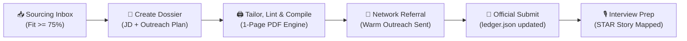

# 📁 Applications & Pipeline Directory

Welcome to the central application operations hub of the **Agentic Career Engine (ACE)**.

---

## 🏛️ Directory Structure

```text
applications/
├── dossier_template/                       # Canonical blueprint for individual job applications
│   ├── job_description.md                 # Requisition requirements, compensation, & source text
│   ├── application_form_guide.md          # Pre-filled cheat sheet for ATS portal submission fields
│   ├── cover_letter.md                    # Tailored 1-page cover letter template
│   ├── outreach_and_timeline.md           # Referral outreach log, message copies, & milestone funnel
│   └── interview_prep.md                  # 90s screen pitch, metrics cheat-sheet, STAR pairings, & questions
├── ledger.json                             # Structured, programmatic source of truth for all applications
├── sourcing_inbox.json                     # Discovered raw job leads from ATS scans
├── sourcing_inbox.md                       # Visual, ranked dashboard of active opportunities (>= 65% fit score)
└── YYYY-MM-DD_[company]_[role_or_reqid]/ # Individual, isolated application dossiers (ignored by git)
    ├── job_description.md
    ├── [Candidate]_Resume_[Company]_[ReqID].md
    ├── [Candidate]_Resume_[Company]_[ReqID].pdf
    ├── application_form_guide.md
    ├── cover_letter.md
    ├── outreach_and_timeline.md
    └── interview_prep.md
```

---

## 📋 The Application Dossier Standard

Whenever you decide to apply for an opportunity, your AI assistant creates an **Application Dossier** folder named `applications/YYYY-MM-DD_[company]_[role_or_reqid]/`.

### 🏷️ Folder Naming & Collision Resolution Hierarchy
To handle applying to multiple roles at the same company on the same day without namespace collisions, dossiers resolve their folder name using the following priority:
1. **Primary (Requisition ID)**: `applications/YYYY-MM-DD_[company]_[reqid]/`  
   *Example*: `applications/2026-09-25_stripe_7118616/`
2. **Fallback 1 (Slugified Job Title)**: If no Requisition ID is provided or unlisted:  
   *Example*: `applications/2026-09-25_stripe_backend-platform/` and `applications/2026-09-25_stripe_infra-architect/`
3. **Fallback 2 (Numeric Increment)**: If applying to identical roles or re-submitting on the same date:  
   *Example*: `applications/2026-09-25_stripe_backend-platform_2/`

### Why Isolate Every Application into a Dossier?
1. **Zero Confusion**: You always know exactly which resume version, bullet points, and cover letter were submitted to which specific requisition.
2. **Pre-Filled Form Guides**: Eliminates portal submission friction by pre-calculating salary inputs, screening answers, and work authorization via `application_form_guide.md`.
3. **Context Persistence**: All notes, recruiter email drafts, outreach dates, and interview cheat-sheets stay grouped with the exact requisition text.
4. **Privacy Safeguard**: The repository's `.gitignore` automatically ignores all `applications/20*` folders, ensuring your confidential job searches and tailored resumes are never pushed to GitHub.

---

## 🔄 The Application Lifecycle



1. **Discovery**: ATS scanner identifies a high-scoring lead in `sourcing_inbox.md` or via `workflows/targeted_job_sourcing_queries.md`.
2. **Dossier Initialization**: Your agent copies the files from `dossier_template/` into `applications/YYYY-MM-DD_[company]/` and saves the job requisition in `job_description.md`.
3. **Tailoring & Linting**: Your agent extracts key requirements from `job_description.md`, tailors your master resume into `[Candidate]_Resume_[Company]_[ReqID].md`, runs `scripts/lint_resume_integrity.ps1` to ensure zero hallucination, and compiles a strict 1-page PDF.
4. **Outreach & Submission**: Warm referral requests are logged in `outreach_and_timeline.md`. When submitted, status in `ledger.json` and `DASHBOARD.md` advances to `Applied`.
5. **Interview Loop Activation**: Your agent populates `interview_prep.md` with a custom 90-second recruiter screen pitch, metric quick-references, whiteboard architecture flows, and role-matched STAR stories from your story bank.
