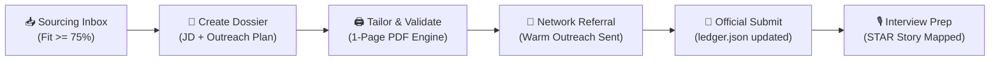

# 📁 Applications & Pipeline Directory

Welcome to the central application operations hub of the **Agentic Career Engine (ACE)**.

---

## 🏛️ Directory Structure

```text
applications/
├── dossier_template/               # Canonical blueprint for individual job applications
│   ├── job_description.md         # Requisition details, compensation, keywords, and raw posting
│   ├── outreach_and_timeline.md   # Referral outreach log, message copies, and milestone funnel
│   └── interview_prep.md          # 90-second screen pitch, metric cheat-sheet, STAR pairings, and questions
├── ledger.json                     # Structured, programmatic source of truth for all applications
├── sourcing_inbox.json             # Discovered raw job leads from ATS scans
├── sourcing_inbox.md               # Visual, ranked dashboard of discovered leads (>= 65% fit score)
└── YYYY-MM-DD_[company]/           # Individual, isolated application dossiers (ignored by git)
    ├── job_description.md
    ├── [Your_Name]_Resume_[Company].md
    ├── [Your_Name]_Resume_[Company].pdf
    ├── outreach_and_timeline.md
    └── interview_prep.md
```

---

## 📋 The Application Dossier Standard

Whenever you decide to apply for an opportunity, your AI assistant creates an **Application Dossier** folder named `applications/YYYY-MM-DD_[company]/` (e.g., `applications/2026-09-24_stripe/`).

### Why Isolate Every Application into a Dossier?
1. **Zero Confusion**: You never wonder which resume version was sent to which company.
2. **Context Persistence**: All notes, recruiter email drafts, outreach dates, and interview cheat-sheets stay grouped with the exact requisition text.
3. **Privacy Safeguard**: The repository's `.gitignore` automatically ignores all `applications/20*` folders, ensuring your confidential job searches and tailored resumes are never pushed to GitHub.

---

## 🔄 The Application Lifecycle



1. **Discovery**: ATS scanner identifies a high-scoring lead in `sourcing_inbox.md`.
2. **Dossier Initialization**: Your agent copies the files from `dossier_template/` into `applications/YYYY-MM-DD_[company]/` and saves the job requisition in `job_description.md`.
3. **Tailoring**: Your agent extracts key requirements from `job_description.md` and tailors your master resume into `[Your_Name]_Resume_[Company].md`, compiling and verifying a strict 1-page PDF.
4. **Outreach & Submission**: Warm referral requests are logged in `outreach_and_timeline.md`. When submitted, status in `ledger.json` and `DASHBOARD.md` advances to `Applied`.
5. **Interview Loop Activation**: Your agent populates `interview_prep.md` with a custom 90-second recruiter screen pitch, metric quick-references, and role-matched STAR stories from your story bank.
