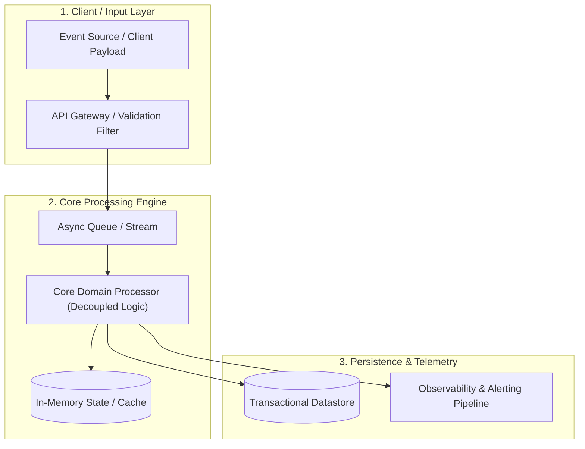

# Interview Preparation & Tactical Cheatsheet: [Company Name]

> **Role**: [Role Title] — Requisition `[ReqID]`  
> **Interview Stage**: [Recruiter Screen / Hiring Manager Loop / Technical Deep-Dive / Panel]  
> **Interviewer(s)**: [Name, Title, Background Notes]  

---

## 🎙️ 1. 90-Second Recruiter Screen Elevator Pitch
*Deliver this concisely when asked: "Tell me about yourself and why you're interested in [Company Name]."*

> *"I am a [Current Title / Core Discipline] with [X] years of experience specializing in [Domain A], [Domain B], and [Domain C]. Most recently at [Current/Previous Company], I led [Major Initiative], delivering [Measurable Metric 1, e.g. 35% reduction in delivery cycles or $500k in cost savings].*  
>  
> *What excited me about this [Target Title] role at [Company Name] is your current initiative around [Company Focus / Scaling Goal / Product Launch]. The challenges you are facing in [Key Problem Area from JD] align directly with what I've spent the last several years executing, and I'm eager to bring that operational rigor to this team."*

---

## 📊 2. High-Impact Metrics Quick-Reference Cheatsheet
*Keep these verified metrics in front of you so you never pause or estimate numbers on calls:*

- **Scale / Volume**: [e.g. 15M monthly active users / $25M budget / 45 cross-functional team members]
- **Efficiency / Velocity Gains**: [e.g. 40% reduction in deployment latency / 25 hours per week saved]
- **Financial / Business Impact**: [e.g. $1.8M ARR expansion / 18% margin improvement / $350k vendor reduction]
- **Compliance / Quality**: [e.g. 99.99% uptime SLA / zero audit findings across 3 consecutive cycles]

---

## 🎯 3. Targeted STAR+R Behavioral Story Pairings

### Competency 1: [Key Competency from JD, e.g. Cross-Functional Execution Under Pressure]
- **Mapped Story**: [Story Title from `stories/star_story_bank.md`]
- **Situation**: [Brief 1-sentence refresher of context]
- **Task**: [What you were responsible for resolving]
- **Action**: [2-3 key actions you spearheaded]
- **Result**: [Specific outcome and quantifiable metric]
- **Reflection**: [Key lesson or leadership principle cemented]
- **Strategic Connection to [Company]**: *"This directly parallels your current challenge with [Problem X]..."*

### Competency 2: [Key Competency from JD, e.g. Strategic Architecture / Process Modernization]
- **Mapped Story**: [Story Title from `stories/star_story_bank.md`]
- **Situation**: [Brief 1-sentence refresher]
- **Task**: [Core objective]
- **Action**: [Strategic interventions executed]
- **Result**: [Quantifiable outcome]
- **Reflection**: [System design principle]
- **Strategic Connection to [Company]**: *"I noticed in the job description that you are standardizing [System Y]; here is how I approached that exact migration..."*

---

## 📐 4. Whiteboard & Architectural Deep-Dive (If Technical / Onsite)

*Prepare an end-to-end architectural diagram or process flow to whiteboard when asked: "How would you design or scale [Core Problem Domain]?"*

- **Trade-off Analysis**: Why this architecture over alternatives (e.g. decoupling compute from persistence to eliminate contention).
- **Failure Modes & Edge Cases**: How the system handles partition failures, retries, or rate limiting.

---

## 👥 5. Multi-Session Panel Strategy & Reverse Questions

### Session A: For Technical Peers / Individual Contributors
- **What they care about**: Day-to-day ergonomics, code maintainability, pragmatic tooling, avoiding bureaucracy.
- **Key Questions to Ask**:
  1. *"When collaborating across teams on this initiative, what is currently the biggest friction point in your daily workflow?"*
  2. *"What tool, workflow, or architectural change made the biggest positive impact on your velocity recently?"*

### Session B: For Hiring Manager / Functional Leadership
- **What they care about**: Release predictability, team health, cross-functional prioritization, delivering against the 90-day roadmap.
- **Key Questions to Ask**:
  1. *"What is the single most critical problem the person in this role must resolve during their first 90 days?"*
  2. *"How does the team currently balance short-term operational firefighting against long-term strategic initiatives?"*

### Session C: For Executive / Department Head
- **What they care about**: Business trajectory, market differentiation, resource allocation, organizational scaling.
- **Key Questions to Ask**:
  1. *"From your vantage point, what market shift or customer requirement will demand the biggest evolution from this team over the next 18 months?"*
  2. *"What does exceptional performance look like for this team at the 1-year mark?"*
