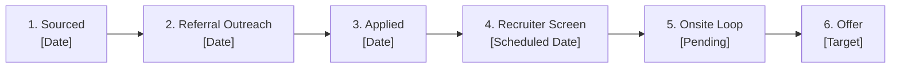

# Outreach & Application Timeline: [Company Name]

> **Role**: [Role Title]  
> **Status**: [Sourced / Outreach Initiated / Applied / Recruiter Screen / Technical Loop / Final Round / Offer / Closed]  
> **Target Follow-Up Date**: [YYYY-MM-DD]  

---

## 👥 Key Contacts & Referral Routing

| Contact Name | Title / Department | Relationship / Source | LinkedIn / Email | Status / Notes |
| :--- | :--- | :--- | :--- | :--- |
| **[Contact 1]** | [e.g. Senior Manager / Peer] | [1st-Degree / Mutual Colleague / Cold] | [Profile Link] | [Warm intro requested] |
| **[Contact 2]** | [e.g. Talent Acquisition Partner] | [Recruiter for this Req] | [Profile Link] | [Application note sent] |

---

## ✉️ Sent Communications & Outreach Log

### Touchpoint 1: [YYYY-MM-DD] — [Internal Referral Request / Application Note]
- **Recipient**: [Name, Title]
- **Channel**: [LinkedIn InMail / Email / Slack Community]
- **Message Sent**:
  > *"[Paste exact message sent to keep your communication history organized and context-ready]"*
- **Outcome / Response**: [e.g. Referred via internal portal / Awaiting reply]

### Touchpoint 2: [YYYY-MM-DD] — [Follow-Up or Thank You Note]
- **Recipient**: [Name, Title]
- **Channel**: [Email / LinkedIn]
- **Message Sent**:
  > *"[Paste follow-up message]"*
- **Outcome / Response**: [Response summary]

---

## ⏱️ Application Milestone Timeline

- **[YYYY-MM-DD]**: Opportunity identified and scored [Fit Score: 88/100].
- **[YYYY-MM-DD]**: Tailored 1-page resume compiled: `[Candidate_Name]_Resume_[Company].pdf`.
- **[YYYY-MM-DD]**: Referral request sent to [Contact Name].
- **[YYYY-MM-DD]**: Official application submitted via [Direct Portal / Greenhouse].
- **[YYYY-MM-DD]**: Recruiter screen confirmed for [Date & Time].
