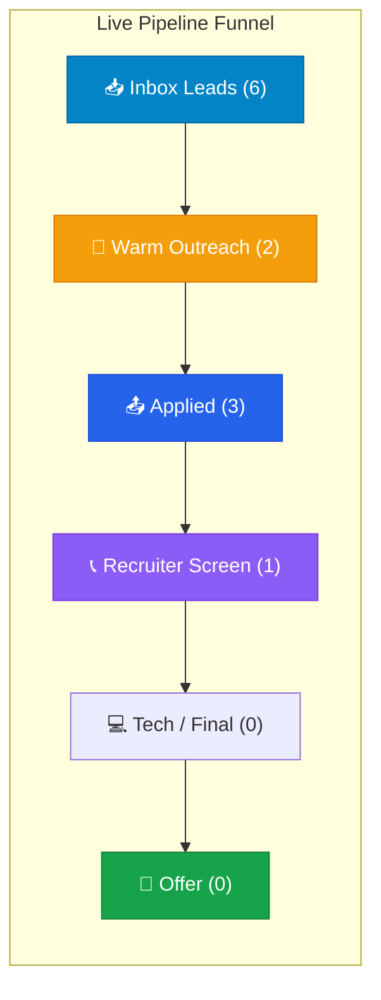

# 🚀 Alex Morgan's Career Command Center

> **Candidate**: Alex Morgan | **Role Focus**: Senior / Staff Platform Engineer, Distributed Systems & Developer Infra  
> **Target Compensation**: **$160,000 – $200,000 / yr** *(Floor: $140,000 | Remote USA)*  
> **Core Focus Window**: 9:00 AM – 2:00 PM (Mon–Fri)  
> **Active Target**: 3 high-leverage applications submitted weekly with verified 1-page PDFs and referral outreach.

---

## ⚡ Current Prioritized Next Steps (Active TODO)

> [!TIP]
> **Weekly Focus**: Prioritize 1st-degree referral outreach at NovaTech and Datadog before submitting general portal applications.

#### 🔥 High-Priority Action Items (This Week)
- [x] **Submit Application to NovaTech Systems**: Submitted customized application for *Senior Platform Engineer* ($165k–$195k base) on Sept 23.  
  👉 *[View NovaTech Dossier](sample_job_description.md)*
- [x] **Warm Referral Outreach to Datadog**: Reached out to Jordan Lee (Staff SRE) for internal referral on *Senior Infrastructure Engineer* requisition.
- [ ] **Follow up with CloudScale Colleague**: Check in with former engineering director regarding open principal roles.
- [ ] **Prepare System Design Architecture Story**: Finalize STAR narrative on Kafka event pipeline for upcoming technical screen.

---

## 📊 Pipeline Progress & Funnel Health

### 📋 Active Application Status
| Company | Role & Requisition | Applied / Active Date | Verified / Est. Comp | Internal Connection | Live Status | Verified Assets |
| :--- | :--- | :--- | :--- | :--- | :--- | :--- |
| **NovaTech Systems** | Senior Platform Engineer (`#4829103`) | `2026-09-23` | **$165,000 – $195,000** | *Direct Apply* | 🔵 **Applied** *(Sept 23)* | [1-Page PDF](Alex_Morgan_Resume.pdf) \| [JD](sample_job_description.md) |
| **Datadog** | Senior Infrastructure Engineer | `2026-09-21` | **$180,000 – $220,000** | Jordan Lee *(Staff SRE)* | 🟡 **Warm Outreach** | [Master Resume](Alex_Morgan_Resume.md) |
| **Stripe** | Backend Platform Engineer | `2026-09-18` | **$190,000 – $240,000** | *Recruiter Inbound* | 🟣 **Recruiter Screen** *(Scheduled)* | [1-Page PDF](Alex_Morgan_Resume.pdf) |

---

## 📈 Cumulative Effort & Velocity Milestones
- **Total Opportunities Evaluated**: 24
- **Qualified Leads in Inbox**: 6
- **Applications Submitted**: 3
- **Warm Referral Rate**: 50%
- **Average Resume Compile Time**: < 3 seconds

---

## 🗂️ Quick Access Workspace Links

- 📥 **[Job Sourcing Lead Inbox (Active Leads)](../../applications/sourcing_inbox.md)**
- ⚙️ **[ATS Search Configuration](../../workflows/ats_search_config.json)**
- 🤖 **[ATS Job Scanner Skill & Procedure](../../.agents/skills/ats-job-scanner/SKILL.md)**
- 📊 **[100-Point Scoring Rubric](../../.agents/skills/ats-job-scanner/references/scoring_rubric.md)**
- 🤝 **[Network Referral Contacts Ledger](../../network/contacts_ledger.md)**
- 📋 **[Master Resume Repository](Alex_Morgan_Resume.md)** *(Audited & verified)*
- 🧩 **[Modular Tailoring Reserve Bank](../../resumes/modular_reserve_bank.md)**
- 📖 **[STAR+R Interview Story Bank](../../stories/star_story_bank.md)**
- 📞 **[Recruiter Screen & Phone Cheat Sheet](../../stories/recruiter_screen_cheatsheet.md)**
- 🌅 **[Career Gap & Sabbatical Framing Guide](../../stories/career_gap_framing.md)**
- 🎯 **[Target Company Tier List](../../companies/target_tier_list.md)**
- 🔍 **[Targeted Direct ATS Search Queries](../../workflows/targeted_job_sourcing_queries.md)**
- ⚡ **[Application Workflow & Operational SOP](../../workflows/job_hunt_workflow.md)**
