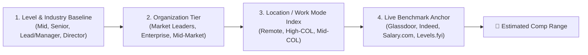

# Compensation Estimation Heuristic

> **Purpose**: A deterministic 4-step framework to estimate realistic Total Compensation (Base + Bonus/Equity) when an ATS job posting omits compensation details.

---

## 📐 The 4-Factor Estimation Formula

$$\text{Estimated Base} = \text{Role Baseline} \times \text{Company Tier Multiplier} \times \text{Geo Index}$$



---

## 1. Role & Seniority Baselines (National US Median Benchmarks)

| Seniority Tier | Typical Tech / Product Range | Typical Corporate / Finance / Ops | Typical Healthcare / Life Sciences |
| :--- | :--- | :--- | :--- |
| **Mid-Level (3–5 yrs)** | $105,000 – $135,000 | $85,000 – $115,000 | $90,000 – $120,000 |
| **Senior (5–8 yrs)** | $135,000 – $170,000 | $110,000 – $145,000 | $115,000 – $150,000 |
| **Lead / Manager (8–12 yrs)** | $165,000 – $210,000 | $135,000 – $180,000 | $140,000 – $185,000 |
| **Director / Head of (12+ yrs)** | $200,000 – $275,000+ | $165,000 – $235,000+ | $175,000 – $250,000+ |

---

## 2. Organization Tier Multiplier

- **Tier 1 (Market Leaders / Global Enterprise / High-Margin Sectors)**: `1.20x – 1.45x`  
  *(e.g., Big Tech, Top Investment Banks, Global Biotech/Pharma, Top Tier Strategy Firms $\rightarrow$ substantial bonuses and equity grants)*.
- **Tier 2 (Mid-to-Large Public Companies / Established National Brands)**: `1.00x – 1.20x`  
  *(e.g., Fortune 500 corporate, established hospital networks, major manufacturing or retail enterprises)*.
- **Tier 3 (Regional Mid-Market / Early Stage / Non-Profit / Public Sector)**: `0.85x – 1.00x`  
  *(e.g., Regional healthcare systems, Series A/B startups, municipal agencies, mid-size private businesses)*.

---

## 3. Location / Work Mode Index

- **Fully Remote (National / Unpegged US Band)**: `1.00x – 1.15x`
- **High-COL Metros (San Francisco Bay Area, NYC, Seattle, Boston)**: `1.20x – 1.40x`
- **Mid-COL Regional Metro Hubs (Austin, Denver, Chicago, Atlanta, Raleigh, Charlotte)**: `0.95x – 1.05x`
- **Lower-COL / Non-Metro / Rural**: `0.85x – 0.95x`

---

## 4. 30-Second Web Validation Query

When evaluating an unlisted role, verify your calculation with a quick search query:
```text
"<Company Name>" "salary" OR "compensation" "<Job Title>" (site:glassdoor.com OR site:indeed.com OR site:salary.com OR site:levels.fyi)
```

---

## 🎯 Candidate Decision Calibration

Calibrate your personal search thresholds in `workflows/ats_search_config.json`:

- 🟢 **Prime Target**: Estimated Base $\ge$ Your Target ($150,000+)
- 🟡 **Acceptable Pipeline Fill**: Estimated Base between Floor and Target ($100,000 – $149,000)
- 🔴 **Below Floor**: Skip unless exceptional equity, mission alignment, or lifestyle flexibility.
- ✈️ **Relocation Threshold**: Requires relocation package + compensation premium.
