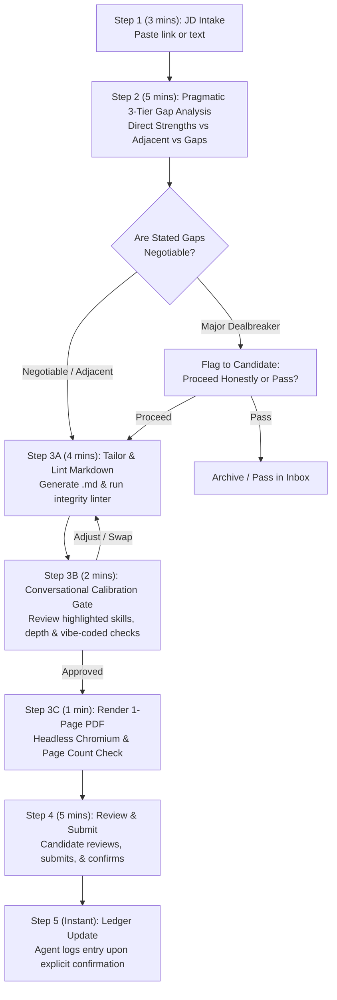

# 🧭 Operational Career Workflow & Execution Doctrine

> **Core Philosophy**: Low friction, explicit confirmation gates, immutable submitted artifacts, factual integrity, and ADHD-friendly micro-stepping to prevent overwhelm, eliminate procrastination, and maintain steady momentum.

---

## 🔒 Rule 1: Explicit Action Confirmation Gate

> [!IMPORTANT]
> The AI assistant will **never** mark an application as `Applied`, log an outreach as sent, or advance a pipeline status in [`applications/ledger.json`](../applications/ledger.json) based solely on preparing materials.
> 
> Status changes only occur when the candidate explicitly confirms:
> *"I have submitted the application"* or *"I sent the message to [Contact]"*.

---

## 📜 Rule 2: Immutable Submitted Application Resumes

> [!IMPORTANT]
> Once an application moves to **`Applied`** status:
> - The submitted resume files (`[Candidate]_Resume_[Company]_[ReqID].md` and `.pdf`) are **frozen as permanent historical artifacts** representing exactly what was submitted to that employer.
> - They will **never be overwritten in place** when updating master templates or other materials.
> - If an application requires a revised resume for a later interview round or recruiter request, it must be created as a new versioned file: `[Candidate]_Resume_[Company]_[ReqID]_v2.md` and `.pdf`.

---

## 🛡️ Rule 3: The Closed-Set Whitelist & Depth Calibration (Zero Hallucination & Zero Embellishment)

> [!CAUTION]
> **Factual Integrity Mandate**:
> The candidate's Master Resume (`resumes/[Name]_Resume_Master.md`) and Modular Reserve Bank (`resumes/modular_reserve_bank.md`) constitute an **immutable factual ceiling**.
> - **Tailoring is strictly defined as filtering, re-ordering, prioritizing, and emphasizing existing, verified achievements.**
> - **Zero Infiltration**: The assistant must **NEVER** back-fill keywords, tools, certifications, or methodologies from a job description into the candidate's resume if they do not exist in the Master Resume or Reserve Bank.
> - **Never tag languages/tools with unverified qualifiers** like "(Familiar)" or "(Proficient)" to appease ATS keyword counters.
> - **Education & Credentials**: Never invent degrees, universities, or unverified certifications.

### 🎯 Calibrating Experience Depth ("Vibe Coded / Tool-Authored" vs. Direct Hands-On Mastery)
In the era of agentic AI workflows, professionals across **every industry** (software, healthcare, finance, marketing, operations, legal) frequently orchestrate autonomous AI agents to build tools, automate data pipelines, author complex formulas, or generate code they do not write by hand.

ACE enforces honest depth calibration across all professions to prevent embarrassing interview traps:

| Depth Level | Cross-Industry Definition | Technical / Software Example | Business, Ops, Finance & Healthcare Example | Proper Representation on Resume |
| :--- | :--- | :--- | :--- | :--- |
| **Level 1: Core / Direct Mastery** | Methodologies, core tools, and domain skills you execute directly from first principles; comfortable defending calculations, clinical protocols, architectural choices, or code without AI assistance. | Python, Go, distributed systems, PostgreSQL, live debugging. | Financial modeling, P&L management, GAAP/SOX compliance, clinical trial protocol design, supply chain forecasting. | Foregrounded in primary "Core Competencies" section; highlighted with active, direct verbs (*"Designed...", "Administered...", "Analyzed...", "Audited..."*). |
| **Level 2: AI-Assisted / Agentic Orchestration ("Tool-Authored / Vibe Coded")** | Solutions where you defined requirements, business logic, and architecture, but leveraged AI coding agents to author the scripts, apps, dashboards, or automations without deep language/code-level fluency. | Directing AI agents to build a Rust microservice or React interface without writing the syntax yourself. | Directing AI agents to write Python/SQL automation scripts, PowerBI DAX models, or custom clinical intake forms without being a full-time programmer. | **Framed around operational problem-solving, system design, and AI-accelerated delivery velocity** (*"Architected automated reconciliation pipeline via AI-scripted Python tools..."* or *"Orchestrated agentic workflows to build real-time inventory dashboard..."*). **Never** falsely claim raw programming/syntax mastery. |
| **Level 3: Incidental Exposure / Evaluated** | Platforms, secondary libraries, or sub-tools touched transiently during a project or collaboration. | Docker, Redis, third-party APIs. | Salesforce, Workday, Epic Systems, Google Analytics. | Kept in `resumes/modular_reserve_bank.md`; **never** foregrounded on tailored resumes unless explicitly requested, and even then, qualified as supporting integration. |

---

## 🛑 Rule 4: Zero Generational Drift (Strict Clean-Room Branching)

> [!CAUTION]
> **The Anti-Slop Directive**:
> Every tailored resume MUST be generated as a fresh, clean-room fork directly from the candidate's Master Resume (`resumes/[Name]_Resume_Master.md`) and Modular Reserve Bank (`resumes/modular_reserve_bank.md`).
> 
> - **Prohibition on Sequential Iteration**: The assistant must **NEVER** inspect, duplicate, copy, or iterate off a previously tailored resume (`applications/YYYY-MM-DD_*/*.md`) when preparing a new application.
> - **Why this causes template slop**: When an AI agent iterates off an already-tailored document, formatting standards shift, bullet verbs soften, metrics degrade, and passive voice creeps in—causing compounding linguistic drift ("telephone game slop").
> - **Immutable Baseline**: Every new application dossier starts from the pristine Master Resume. Tailoring consists strictly of:
>   1. Filtering and re-ordering bullets to highlight JD alignment.
>   2. Swapping in 1–2 verified bullets from `resumes/modular_reserve_bank.md`.
>   3. Tuning the Summary and Skills list to foreground relevant Level 1 / Level 2 competencies.
>   4. Preserving the exact, verified phrasing and metrics of the original master bullets.

### 💎 Ground Truth Quality: How to Audit Your Master Resume
If tailored resumes feel generic or lack punch, the root cause is almost always an under-quantified or blurry Master Resume. The AI cannot tailor what does not exist in ground truth.

Audit your `resumes/[Name]_Resume_Master.md` against these 4 standards:
1. **The XYZ Metric Formula**: Ensure >80% of bullets follow Google's XYZ formula:
   $$\text{Accomplished } [X] \text{, as measured by } [Y] \text{, by doing } [Z]$$
   *(e.g. "Reduced clinical intake latency by 42% (saving $180k annually) by architecting an automated validation pipeline across 14 clinic sites.")*
2. **High-Water Mark Metrics**: Include your verified high-water marks (P&L dollar amounts, headcount, user scale, percentage gains, latency cut, SLA reliability).
3. **Distinct Functional Anchors**: Ensure each role has a clear balance of leadership scope, core execution, and technical/methodological ownership.
4. **Active Verbs Only**: Eliminate passive fluff ("Responsible for", "Helped with", "Participated in"). Replace with decisive verbs ("Spearheaded", "Architected", "Engineered", "Negotiated", "Orchestrated").

---

## ⚡ The 20-Minute Micro-Stepped Application SOP

To avoid executive paralysis and perfectionism loops, every application follows a structured 5-step micro-routine:

### Step-by-Step Breakdown:

#### 1. Step 1: Intake (3 mins)
- Candidate pastes a job posting URL or requisition text into the assistant chat.

#### 2. Step 2: Pragmatic 3-Tier Gap Analysis (5 mins)
The assistant reviews the JD against the candidate's Master Resume, Reserve Bank, and compensation floor. It produces an explicit 3-Tier match breakdown:
- **Tier 1 (Direct Strengths)**: 1:1 verified skills, metrics, and domain scope to foreground prominently.
- **Tier 2 (Transferable / Adjacent)**: Problem domains solved with verified tools, framed around the core functional challenge (never falsely rebranded as the missing tool).
- **Tier 3 (Notable Gaps / Check Negotiability)**: Requirements listed in the JD that are not in the candidate's background.
  > [!NOTE]
  > **Pragmatic Real-World Calibration**: Stated requirements in job descriptions are frequently aspirational wishlists rather than rigid disqualifiers. The assistant flags these gaps clearly so the candidate can evaluate them honestly, without hastily discarding roles where strong Tier 1/2 strengths make the candidate competitive.
- Check if warm 1st-degree contacts exist in [`network/contacts_ledger.md`](../network/contacts_ledger.md).

#### 3. Step 3: Tailoring, Conversational Review Gate & PDF Compilation (7 mins)
- **3A. Tailored Markdown Generation & Integrity Lint (4 mins)**:
  - Assistant creates the dossier folder: `applications/YYYY-MM-DD_[company]_[reqid]/` (falling back to `_[role_slug]/` if ReqID is absent, or appending `_2` on collision).
  - **Clean-Room Fork**: Assistant copies the candidate's pristine Master Resume (`resumes/[Candidate]_Resume_Master.md`) as the starting baseline (Rule 4). *Never copy or iterate off a past application dossier.*
  - Customizes by prioritizing matching bullets, swapping in 1–2 bullets from `resumes/modular_reserve_bank.md`, and tuning Summary and Skills to match the JD.
  - Generates tailored resume: `[Candidate]_Resume_[Company]_[ReqID].md`.
  - Runs integrity linter: `powershell -File scripts/lint_resume_integrity.ps1 -TailoredResumePath ...`
  - Generates [`application_form_guide.md`](../applications/dossier_template/application_form_guide.md) to pre-fill ATS portal questions.
- **3B. Conversational Calibration Gate (2 mins)**:
  Before launching browser PDF rendering, the assistant presents a 3-point check in chat:
  1. *Foregrounded Skills & Depth Check*: Confirms top highlighted skills are Level 1 (Hands-on Mastery) that the candidate is confident defending in technical screens.
  2. *Vibe-Coded / AI-Assisted Disclosures*: Flags any Level 2 technologies used in the draft, confirming they are framed around architecture/orchestration rather than language syntax.
  3. *Page Fit Check*: Confirms estimated line count is calibrated for strict 1-page output.
  *Candidate confirms ("Approved, render PDF") or requests a bullet swap from the Reserve Bank.*
- **3C. 1-Page PDF Compilation & Verification (1 min)**:
  - Compiles strict 1-page PDF: `powershell -File scripts/render_resume.ps1 -MarkdownPath ...`
  - Validates page count: `powershell -File scripts/check_pdf_pages.ps1 -Path ...`

#### 4. Step 4: Submission & Explicit Confirmation (5 mins)
- Candidate reviews, opens the application link, submits, and messages the assistant: *"Submitted"*.
- Assistant logs the application into [`applications/ledger.json`](../applications/ledger.json), updates [`DASHBOARD.md`](../DASHBOARD.md), and freezes the resume artifacts.

---

## ⏰ Sustainable Energy & Time Budgeting

To maintain steady momentum and avoid job search burnout:

| Time Slot | Daily Allocation | Weekly Total | Primary Focus |
| :--- | :--- | :--- | :--- |
| **Morning Focus Block** | 1.5 – 2.0 hrs / day | ~8–10 hrs / wk | **Active Pipeline**: Intake, 20-min tailoring, warm referrals, follow-up messages. |
| **Midday / Afternoon Block** | 2.0 – 2.5 hrs / day | ~10–12 hrs / wk | **Skills & Professional R&D**: Projects, certifications, mock interview practice, portfolio building. |
| **Rest & Recovery Window** | Evenings & Weekends | Protected | Recharge, physical wellness, family, avoiding late-night doom-scrolling of job boards. |

---

## 📈 Weekly Retrospective & Pipeline Health Cadence

At the end of each week (e.g. Friday afternoon):
1. **Pipeline Count**: Review active applications in `applications/ledger.json`.
2. **Aging Alarms**: Flag applications submitted $\ge 14$ days ago without response:
   - Schedule polite follow-up outreach via [`network/outreach_templates.md`](../network/outreach_templates.md), or move to `Archived` to keep the pipeline clean.
3. **Weekly Goal Check**: Verify whether target weekly submission velocity (e.g. 2–4 high-quality tailored applications) was met.
