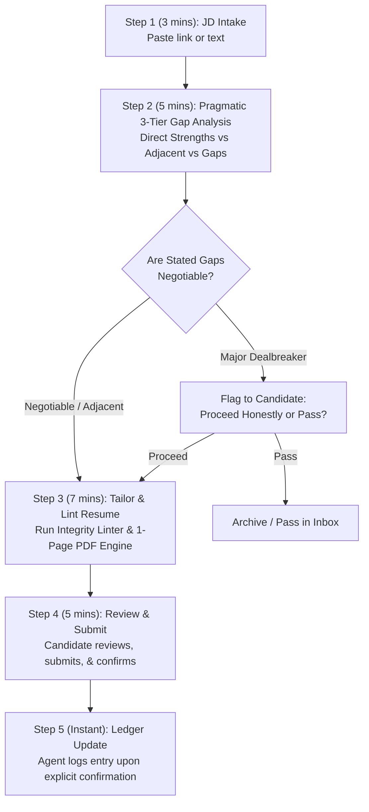

# 🧭 Operational Career Workflow & Execution Doctrine

> **Core Philosophy**: Low friction, explicit confirmation gates, immutable submitted artifacts, factual integrity, and ADHD-friendly micro-stepping to prevent overwhelm, eliminate procrastination, and maintain steady momentum.

---

## 🔒 Rule 1: Explicit Action Confirmation Gate

> [!IMPORTANT]
> The AI assistant will **never** mark an application as `Applied`, log an outreach as sent, or advance a pipeline status in [`applications/ledger.json`](../applications/ledger.json) based solely on preparing materials.
> 
> Status changes only occur when the candidate explicitly confirms:
> *"I have submitted the application"* or *"I sent the message to [Contact]"*.

---

## 📜 Rule 2: Immutable Submitted Application Resumes

> [!IMPORTANT]
> Once an application moves to **`Applied`** status:
> - The submitted resume files (`[Candidate]_Resume_[Company]_[ReqID].md` and `.pdf`) are **frozen as permanent historical artifacts** representing exactly what was submitted to that employer.
> - They will **never be overwritten in place** when updating master templates or other materials.
> - If an application requires a revised resume for a later interview round or recruiter request, it must be created as a new versioned file: `[Candidate]_Resume_[Company]_[ReqID]_v2.md` and `.pdf`.

---

## 🛡️ Rule 3: The Closed-Set Whitelist Rule (Zero Hallucination)

> [!CAUTION]
> **Factual Integrity Mandate**:
> The candidate's Master Resume (`resumes/[Name]_Resume_Master.md`) and Modular Reserve Bank (`resumes/modular_reserve_bank.md`) constitute an **immutable factual ceiling**.
> - **Tailoring is strictly defined as filtering, re-ordering, prioritizing, and emphasizing existing, verified achievements.**
> - **Zero Infiltration**: The assistant must **NEVER** back-fill keywords, tools, certifications, or methodologies from a job description into the candidate's resume if they do not exist in the Master Resume or Reserve Bank.
> - **Never tag languages/tools with unverified qualifiers** like "(Familiar)" or "(Proficient)" to appease ATS keyword counters.
> - **Education & Credentials**: Never invent degrees, universities, or unverified certifications.

---

## ⚡ The 20-Minute Micro-Stepped Application SOP

To avoid executive paralysis and perfectionism loops, every application follows a structured 4-step micro-routine:

### Step-by-Step Breakdown:

#### 1. Step 1: Intake (3 mins)
- Candidate pastes a job posting URL or requisition text into the assistant chat.

#### 2. Step 2: Pragmatic 3-Tier Gap Analysis (5 mins)
The assistant reviews the JD against the candidate's Master Resume, Reserve Bank, and compensation floor. It produces an explicit 3-Tier match breakdown:
- **Tier 1 (Direct Strengths)**: 1:1 verified skills, metrics, and domain scope to foreground prominently.
- **Tier 2 (Transferable / Adjacent)**: Problem domains solved with verified tools, framed around the core functional challenge (never falsely rebranded as the missing tool).
- **Tier 3 (Notable Gaps / Check Negotiability)**: Requirements listed in the JD that are not in the candidate's background.
  > [!NOTE]
  > **Pragmatic Real-World Calibration**: Stated requirements in job descriptions are frequently aspirational wishlists rather than rigid disqualifiers. The assistant flags these gaps clearly so the candidate can evaluate them honestly, without hastily discarding roles where strong Tier 1/2 strengths make the candidate competitive.
- Check if warm 1st-degree contacts exist in [`network/contacts_ledger.md`](../network/contacts_ledger.md).

#### 3. Step 3: Tailored Markdown Generation, Linting & PDF Compilation (7 mins)
- Assistant creates the dossier folder: `applications/YYYY-MM-DD_[company]_[reqid]/` (falling back to `_[role_slug]/` if ReqID is absent, or appending `_2` if applying to multiple identical roles on the same day).
- Generates tailored resume: `[Candidate]_Resume_[Company]_[ReqID].md`.
- Runs integrity linter: `powershell -File scripts/lint_resume_integrity.ps1 -TailoredResumePath ...`
- Compiles strict 1-page PDF: `powershell -File scripts/render_resume.ps1 -MarkdownPath ...`
- Validates page count: `powershell -File scripts/check_pdf_pages.ps1 -Path ...`
- Generates [`application_form_guide.md`](../applications/dossier_template/application_form_guide.md) to pre-fill ATS portal questions.

#### 4. Step 4: Submission & Explicit Confirmation (5 mins)
- Candidate reviews, opens the application link, submits, and messages the assistant: *"Submitted"*.
- Assistant logs the application into [`applications/ledger.json`](../applications/ledger.json), updates [`DASHBOARD.md`](../DASHBOARD.md), and freezes the resume artifacts.

---

## ⏰ Sustainable Energy & Time Budgeting

To maintain steady momentum and avoid job search burnout:

| Time Slot | Daily Allocation | Weekly Total | Primary Focus |
| :--- | :--- | :--- | :--- |
| **Morning Focus Block** | 1.5 – 2.0 hrs / day | ~8–10 hrs / wk | **Active Pipeline**: Intake, 20-min tailoring, warm referrals, follow-up messages. |
| **Midday / Afternoon Block** | 2.0 – 2.5 hrs / day | ~10–12 hrs / wk | **Skills & Professional R&D**: Projects, certifications, mock interview practice, portfolio building. |
| **Rest & Recovery Window** | Evenings & Weekends | Protected | Recharge, physical wellness, family, avoiding late-night doom-scrolling of job boards. |

---

## 📈 Weekly Retrospective & Pipeline Health Cadence

At the end of each week (e.g. Friday afternoon):
1. **Pipeline Count**: Review active applications in `applications/ledger.json`.
2. **Aging Alarms**: Flag applications submitted $\ge 14$ days ago without response:
   - Schedule polite follow-up outreach via [`network/outreach_templates.md`](../network/outreach_templates.md), or move to `Archived` to keep the pipeline clean.
3. **Weekly Goal Check**: Verify whether target weekly submission velocity (e.g. 2–4 high-quality tailored applications) was met.
